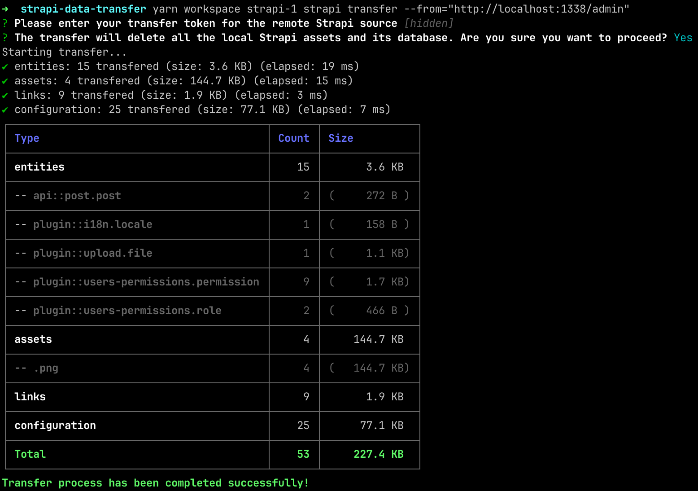
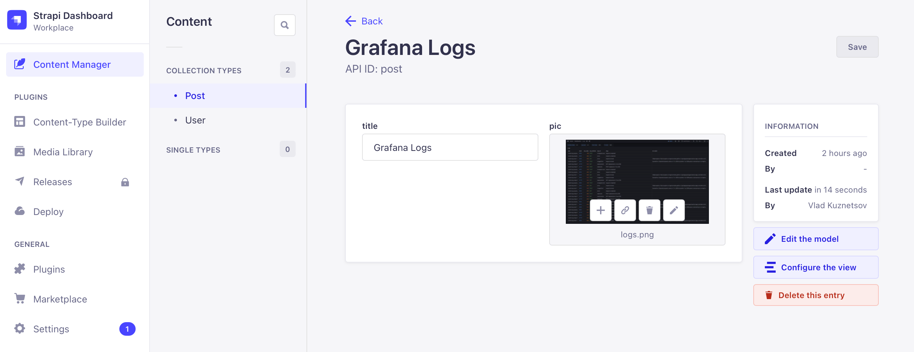
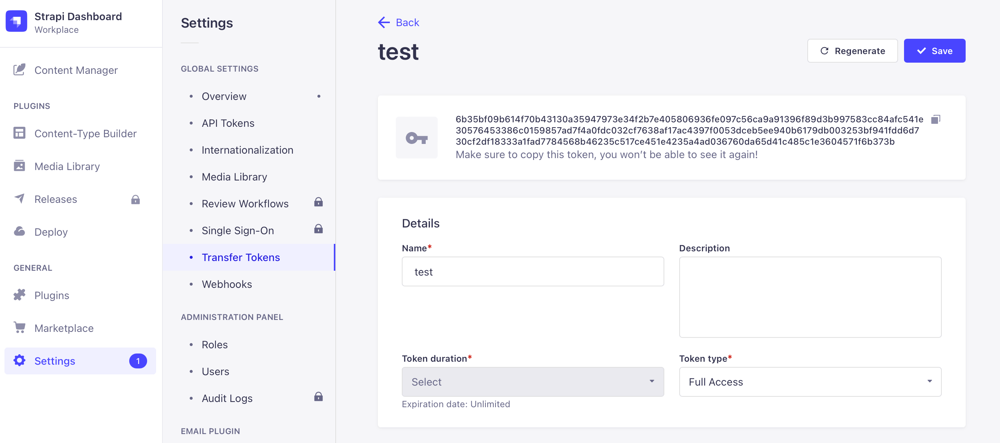

# Пример переноса данных между Strapi инстансами

Документацию к трансферу данных можно посмотреть тут:
[https://docs.strapi.io/dev-docs/data-management/transfer](https://docs.strapi.io/dev-docs/data-management/transfer).

Трансфер переносит как данные БД, так и файлы. При этом все данные инстанса
акцептора стираются.



## Демонстрация

В демонстрации запускается 2 инстанса Strapi с одинаковой схемой данных.
Приложения подключены в разные БД PostgreSQL и разные бакеты S3 Minio.

**Поднимаем окружение**. Автоматически создаются 2 БД в СУБД PostgreSQL 14, с
помощью minio-client создаются 2 бакета в S3 Minio для разных приложений.
Команда выполняется из корня проекта.

```sh
cd _docker && docker compose up -d postgres minio minio-client
```

**Запуск приложений**. Конфигурация по умолчанию подходит для подключения к
PostgreSQL, S3 Minio, конфигурации которых определены в
[`_docker/docker-compose.yml`](./_docker/docker-compose.yml). Приложения займут
1337 и 1338 порты по умолчанию.

```sh
cd .. && \
  yarn workspace strapi-1 strapi develop && \
  yarn workspace strapi-2 strapi develop
```

**Создаем администратора**. Можно создать через Strapi UI, но я предпочитаю это
делать через CLI:

```sh
yarn workspace strapi-1 strapi admin:create-user --firstname=Vlad --lastname=Kuznetsov --email=v.kuznetsov@proscom.ru --password=Qwerty12 && \
yarn workspace strapi-2 strapi admin:create-user --firstname=Vlad --lastname=Kuznetsov --email=v.kuznetsov@proscom.ru --password=Qwerty12
```

**Создаем записи в Content Manager** в одном из приложений. Например, в
[`strapi-2`](./packages/strapi2/). Через Strapi UI загружаем файлы, создаем
посты.



**Создаем Transfer Token**. Во вкладке Settings > Transfer Tokens создаем
токен. Нам хватит доступа Pull, но можно выбрать Full Access.



**Запускаем Strapi Data Transfer** в другом приложении. В нашем случае в [`strapi-1`](./packages/strapi1/).

```sh
yarn workspace strapi-1 strapi transfer --from="http://localhost:1338/admin"
```

Если все правильно настроили, то все данные `strapi-2` перенесутся в `strapi-1`.
