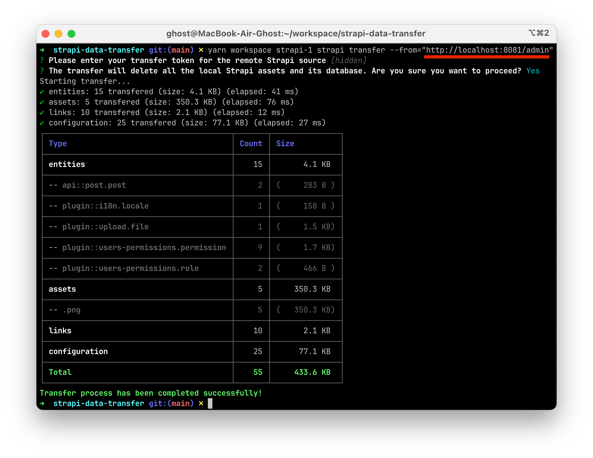

# Пример переноса данных между Strapi инстансами

Документацию к трансферу данных можно посмотреть тут:
[https://docs.strapi.io/dev-docs/data-management/transfer](https://docs.strapi.io/dev-docs/data-management/transfer).

Трансфер переносит как данные БД, так и файлы. При этом все данные инстанса
акцептора стираются.


## Оглавление

- [Демонстрация](#демонстрация)
- [Спрятал один инстанс за nginx](#спрятал-один-инстанс-за-nginx)
- [Практика реального использования](#практика-реального-использования)

## Демонстрация

В демонстрации запускается 2 инстанса Strapi с одинаковой схемой данных.
Приложения подключены в разные БД PostgreSQL и разные бакеты S3 Minio.

**Поднимаем окружение**. Автоматически создаются 2 БД в СУБД PostgreSQL 14, с
помощью minio-client создаются 2 бакета в S3 Minio для разных приложений.
Команда выполняется из корня проекта.

```sh
cd _docker && docker compose up -d postgres minio minio-client
```

**Запуск приложений**. Конфигурация по умолчанию подходит для подключения к
PostgreSQL, S3 Minio, конфигурации которых определены в
[`_docker/docker-compose.yml`](./_docker/docker-compose.yml). Приложения займут
1337 и 1338 порты по умолчанию.

```sh
cd .. && \
  yarn workspace strapi-1 strapi develop && \
  yarn workspace strapi-2 strapi develop
```

**Создаем администратора**. Можно создать через Strapi UI, но я предпочитаю это
делать через CLI:

```sh
yarn workspace strapi-1 strapi admin:create-user --firstname=Vlad --lastname=Kuznetsov --email=v.kuznetsov@proscom.ru --password=Qwerty12 && \
yarn workspace strapi-2 strapi admin:create-user --firstname=Vlad --lastname=Kuznetsov --email=v.kuznetsov@proscom.ru --password=Qwerty12
```

**Создаем записи в Content Manager** в одном из приложений. Например, в
[`strapi-2`](./packages/strapi2/). Через Strapi UI загружаем файлы, создаем
посты.


**Создаем Transfer Token**. Во вкладке Settings > Transfer Tokens создаем
токен. Нам хватит доступа Pull, но можно выбрать Full Access.


**Запускаем Strapi Data Transfer** в другом приложении. В нашем случае в [`strapi-1`](./packages/strapi1/).

```sh
yarn workspace strapi-1 strapi transfer --from="http://localhost:1338/admin"
```

Если все правильно настроили, то все данные `strapi-2` перенесутся в `strapi-1`.

## Спрятал один инстанс за nginx

Развернул в Docker веб-сервер (nginx) и спрятал один инстанс за него.
Конфигурация тут [`nginx.conf`](./_docker/nginx/nginx.conf). И файлы и данные
получилось перенести, линковка не потеряна. Помним что приложения запущены на
`localhost:1337`, `localhost:1338`.



Но если упаковывать один из инстансов в Docker, то перенос выполнить не
удается. Потому что внутри Docker контейнера нет связи с Minio по localhost. В
трансфере для получения файлов, похоже используется внешнее подключение, и
изнутри контейнера до `127.0.0.1:9000` не удается достучаться. На стендах, по
идее должно работать. Поскольку изнутри контенейнера можно обращаться на адрес,
доступный в интернете.

## Практика реального использования

Сделал несколько попыток переноса данных с настоящих Strapi проектов,
запущенных на удаленных стендах. Естественно, они имеют более сложные
конфигурации, чем в этом демонстрационном проекте. Полностью перенести данные у
меня пока не удавалось. На проектах разные версии Strapi (> 4.10). В интернете
находил много issue, посвященных не корректной работе Strapi Data Transfer.
Пока складывается ощущение не полностью работоспособного функционала. Об
ошибках инстанс-донор и инстанс-акцептор могут умалчивать. Сталкивался с тем,
что просто ничего не происходит. Был также и частичный успех, все данные БД
перенеслись, а файлы нет - только одна запись в БД, ошибок выведено не было.
